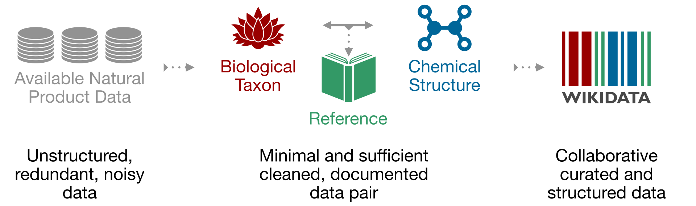
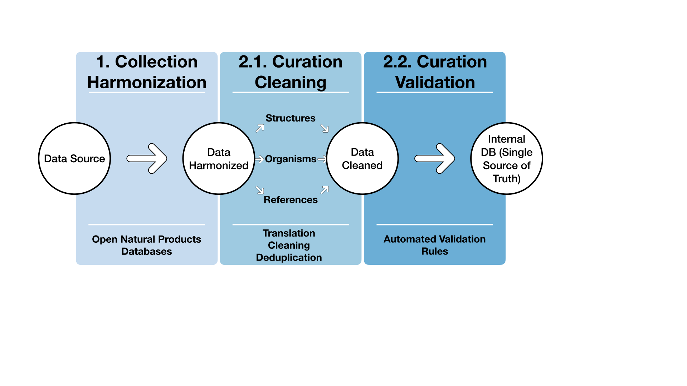
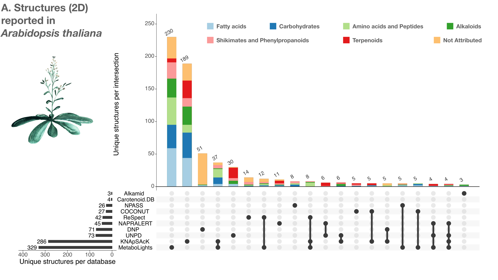
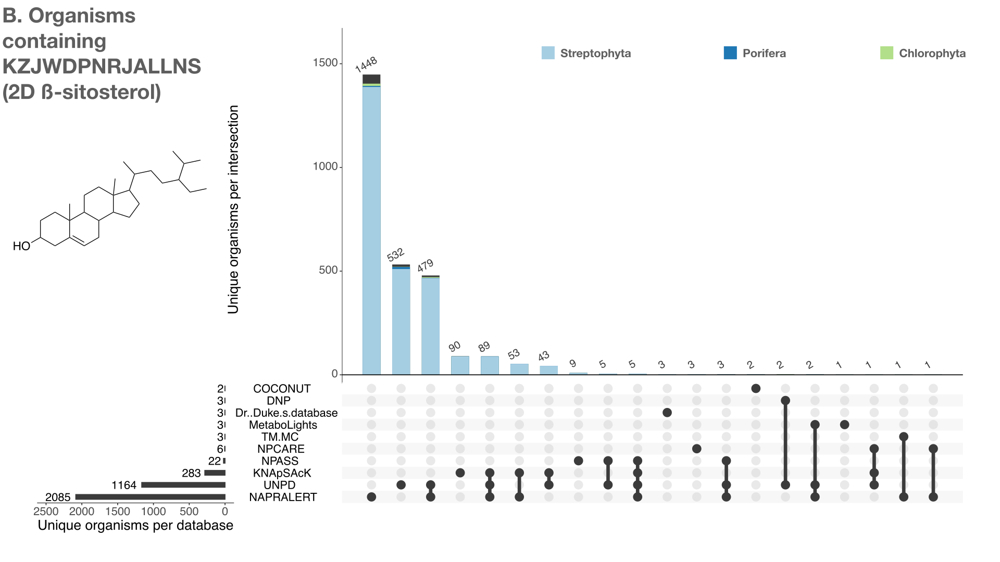

[transition=none,%notitle]
== What is **LOTUS** ?

[.stretch]

=== How did we built **LOTUS** ?

[.stretch]

[%step]
[cols = "4*^.^,%autowidth.stretch]
|===
||Structure|Organism|Reference

|**Before curation**
|Cyathocaline
|Stem bark of Cyathocalyx zeylanica CHAMP. ex HOOK. f.
& THOMS.
(Annonaceae)
|Wijeratne E. M. K., de Silva L. B., Kikuchi T., Tezuka Y., Gunatilaka A. A. L., Kingston D. G. I., J. Nat.
Prod., 58, 459-462 (1995).

|**After curation**
|VFIIVOHWCNHINZ-UHFFFAOYSA-N
|Cyathocalyx zeylanicus
|10.1021/NP50117A020
|===

=== Why **LOTUS** for metabolomics?

[.stretch]

[%step]
Metabolites annotation!

=== _Arabidopsis_ example

[.stretch]

=== Beta-sitosterol example

[.stretch]

